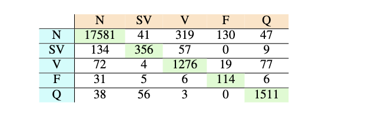

# nRF52-ECG-Beat-Detection-TinyML-

## Overview
This repository contains the firmware for a real-time ECG signal monitoring and AI based beat detection system using Nordic Semiconductor's nRF52840 chipset. The system supports ECG data acquisition, BLE communication, and Edge Impulse-based machine learning for real-time classification. It transmits sensor data through the Nordic UART Service (NUS) for remote monitoring. The firmware is built using the nRF5 SDK (version 17.0.2) and integrates BLE functionality with the SoftDevice S140 v6.1.0.

### Sensor Inputs:
- **ECG data acquisition** using the SAADC (Successive Approximation Analog-to-Digital Converter)
- **Edge Impulse-based Beat-by-Beat classification** on incoming ECG data

## Features
- **ECG Signal Processing**: Continuous ECG data acquisition with real-time classification using ANN model.
- **ECG Classification**: Classifies into 5 classes such as Normal (N), supraventricular (SV), ventricular (V), Fusion (F), and Unknown (Q) beats
- **BLE Communication**: Sends sensor data over BLE via the Nordic UART Service (NUS) for real-time monitoring.

## Setup

### Prerequisites

**Hardware**:
- nRF52840 development board
- Sensors: AD8232 chip and cprresponding analog front end (AFE)

**Software**:
- nRF5 SDK v17.0.2
- VS Code
- SoftDevice S140 v6.1.0 (for BLE)
- Edge Impulse Studio for model training and deployment

### Dependencies
- **BLE SDK Components**: Nordic UART Service (NUS), BLE advertising, BLE connection parameters
- **SAADC Module**: For ECG data acquisition
- **Timers and PPI**: For handling SAADC timed sampling
- **Linker Description (.ld)**: For enabling the compatibility of C/C++ projects
- **Edge Impulse SDK**: For on-device machine learning inference
- **MIT-BIH Arrhythmia Dataset**: For train and test sets (60% / 20% / 20%: train / validation / test dataset)
- **nRF Logging**: For debugging over UART or RTT

## SAADC
- Sampling rate: 2.77 ms (~360 samples per second)
- Resolution: 10 bits
- Continuous sampling with buffer size of 185 samples

## ANN Model
- 3 dense layers: 32, 64, and 128 neurons
- Real-time inference latency: 6 ms
- RAM usage: 2.3 kB
- Flash usage: 77.6 kB
- Training accuracy: 97%
- Testing accuracy (tested from BLE SoC side): 90.6% 

## BLE Specifications
- Advertising name: `CPS_ADC_ML2`
- Speed: 1 Mbps
- Baud rate: 115200 kbps (UART)
- Advertising interval: 40 ms
- Minimum connection interval: 20 ms
- Maximum connection interval: 100 ms
- Advertising duration: 180 seconds (3 minutes)
- Data length (BLE packet size): 7 / 192 bytes

## Machine Learning Integration
- **Edge Impulse** is used to classify ECG beats based on the input features acquired from sensors.
- On-device inference runs every 185 samples of sensor data.
- Real-time results are transmitted over BLE.

## Important Function Definitions
- **saadc_init()**: Initializes the SAADC for ECG data acquisition.
- **saadc_callback()**: Processes ADC data, triggered by a PPI event, to store samples in a buffer.
- **process_input()**: Prepares the data for classification using the Edge Impulse model.
- **run_classifier()**: Executes the Edge Impulse model on the input data and outputs classification results.
- **normalize()**: Normalizes the raw sensor data to prepare it for inference.
- **smoothData()**: Performs smoothing on sensor data using a moving average to reduce noise.

## BLE Packet Structure
- **Option 1:**: 192 bytes (ECG samples (185 bytes) | Classification score: N, SV, V, F, Q beats (5 bytes) | Anomaly score (1 byte) | Prediction function return 'OK' (1 byte))
- **Option 2**: 7 bytes (Classification score: N, SV, V, F, Q beats (5 bytes) | Anomaly score (1 byte) | Prediction function return 'OK' (1 byte))

## Confusion Matrix

The following confusion matrix visualizes the classification results across different labels:

